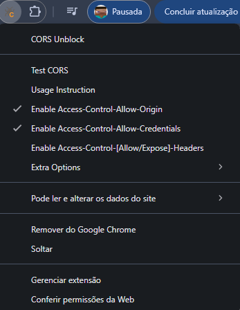
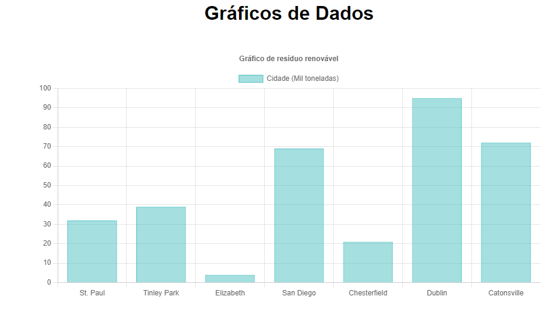

# Projeto de Gráficos de Resíduos Renováveis

## Integrantes
1. Pedro Guttiere - rm555445
2. Oliver Kanai Trindade - rm554954
3. William Weile Feng - rm555132

## Introdução
Este projeto é uma aplicação web desenvolvida com React e Vite para visualizar gráficos relacionados à geração de energia a partir de resíduos renováveis. A aplicação permite ao usuário inserir dados sobre diferentes tipos de resíduos e visualizar gráficos baseados nesses dados. Além disso, é possível armazenar e recuperar informações usando o `localStorage` e realizar requisições para uma API externa para buscar dados de cidades.

## Funcionalidades

- **Gráficos interativos**: Visualização de gráficos de barras sobre os resíduos renováveis e a energia gerada a partir deles.
- **Inserção de dados**: O usuário pode inserir novos dados sobre o tipo de resíduo e a quantidade (kg), com cálculo da energia gerada.
- **Armazenamento local**: Os dados inseridos são armazenados localmente usando `localStorage` para persistência entre sessões.
- **API de dados**: Dados de cidades são obtidos via API externa para ilustrar a utilização de dados dinâmicos.
- **Logout e navegação**: O usuário pode sair da aplicação, removendo seu ID de usuário do `localStorage` e sendo redirecionado para a página inicial.

## Tecnologias Utilizadas

- **React**: Biblioteca JavaScript para construção de interfaces de usuário.
- **Vite**: Ferramenta de build e bundling moderna para React.
- **Chart.js**: Biblioteca para criação de gráficos interativos.
- **React Router**: Gerenciamento de rotas para navegação entre diferentes páginas.
- **localStorage**: Armazenamento de dados persistentes no navegador.
- **API Mock**: Uso de uma API externa para buscar dados de cidades.

## Como Rodar o Projeto

### Requisitos

- Node.js (versão 16 ou superior)
- npm (ou yarn) instalado

### Passos para execução

1. Clone o repositório:
   ```bash
   git clone https://github.com/seu-usuario/nome-do-repositorio.git

2. Acesse o diretório do projeto:
cd nome-do-repositorio

3. Instale as dependências:
npm install

4. Inicie o servidor de desenvolvimento:
npm run dev

## Não está funcionando o gráfico MockAPI(Gráfico):
1. Acessar google chrome
2. Ir para o webStore
3. Adicionar a extensão CORS Unblock
4. ativar essas seguintes informações:
## Imagem1


## Imagem2
A imagem terá como:

